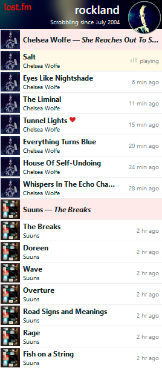

# 🔴 lastfm-widgets

*Tracks* is a javascript web-widget to show "scrobbles" (play history) from a [Last-fm](https://www.last.fm/) account.
See *Tracks* in action on https://www.rockland.dk/ and https://lastfm-widgets.deno.dev/. At the latter site, you
can not only find some more information and instructions for use, you can also play with some of the customization
options, including setting the user to show scrobbles from. 

Long time Last.fm users might get a déjà vu feeling by the red album header-lines. As primarily an album listener
myself, I have missed them. So I brought them (optionally) back in this widget.

As name of this repository hints, I might have more than one Last.fm widget planned for this space 🙂

## The technical...

The *Tracks* widget itself is made as a *webcomponent* using pure standard web client-side technologies
(no frameworks or build tools needed). It can work "alone" communicating directly with Last.fm's
Audioscrobbler v2 API, or it can be supported by a custom backend "proxy-api". The latter is encouraged
when possible, because it makes it possible to implement throttling of requests to Last.fm's API.

This repository not only holds the widget itself, but also the demo page (https://lastfm-widgets.deno.dev/) and an
example backend proxy-api. The proxy-api is made in [Deno](https://deno.com/) (server-side javascript/typescript).
Also, this repository is set up as a [Deno Deploy](https://deno.com/deploy) project. Any updates in main-branch are
immediately deployed to the demo-site at https://lastfm-widgets.deno.dev/.

The widget (frontend code) should be compatible back to at least Firefox 115 and Chromium 109 based web-browsers
(which are versions still compatible with Windows 7/8 installations). It also runs in Safari, but unsure how old
versions are supported (I'm not able to test that myself). The backend code is my first simple experiments/experience
with Deno. It is tested with Deno 1.46 and Deno 2.0.

#### /widgets/ folder

The widget frontend code. *All* that is needed for widget to work in *Demo* or *Basic* mode. See
[Releases](https://github.com/StigNygaard/lastfm-widgets/releases) to get latest "release-version" of this folder's
content. And see https://lastfm-widgets.deno.dev/ for more about widget *modes* and how to use and customize the widget.

#### /demo/ folder

Frontend-code for the demo page seen on https://lastfm-widgets.deno.dev/

#### /services/ folder

- *proxy-api.ts* - An example backend proxy-api made with Deno. The proxy-api is used on demo page when
widget is in *Backend-supported* mode, but also used by widget on [rockland.dk](https://www.rockland.dk/).
- *log.ts* - A simple log endpoint used by the demo page.

#### /main.ts file

Basically the "web-server" or "router" for https://lastfm-widgets.deno.dev/, serving above-mentioned content.

## Future updates?

What could future updates bring? *Maybe*:
- A layout that adapt nicer to wider display dimensions of widget
- Dark mode
- Refactoring code *if* I'm in the mood for that kind of thing 🙂
- More documentation (especially on the Deno proxy-api implementation when it feels a bit more mature)
- Another widget
