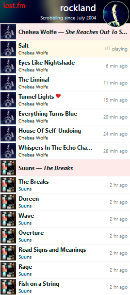

# 🔴 lastfm-widgets

See *Tracks* widget in action on https://lastfm-widgets.deno.dev/ and https://www.rockland.dk/. At the first site,
the plan is you should be able to try widget showing scrobbles from your own Last-fm account, and play with various
other configuration options. But that is not fully ready yet.

As name of this repository hints, I might have more than one Last.fm widget planned for this space 🙂

## The technical...

The *Tracks* widget itself is made as a *webcomponent* using pure standard web client-side technologies (no frameworks
or build tools needed). It can work "alone" communicating directly with Last.fm's Audioscrobbler v2 API, or it can be
supported by a custom backend "proxy-api". The latter is recommended because it makes it possible to implement
throttling of requests to Last.fm's API.

This repository not only holds the widget itself, but also a demo page and an example backend proxy-api. The
proxy-api is made in [Deno](https://deno.com/) (server-side typescript/javascript). Also, this repository is set
up as a [Deno Deploy](https://deno.com/deploy) project. Any updates in main-branch are immediately
deployed to https://lastfm-widgets.deno.dev/.

The widget (frontend code) should be compatible back to at least Firefox 115 and Chromium 109 based web-browsers
(which are the last versions of these running on Windows 7/8 installations). It also runs in Safari, but unsure
how old versions are supported (I'm not able to test that myself).
The backend code is my first simple experiments/experience with Deno. It has been tested with the first Release
Candidate version of Deno 2.

#### /widgets/ folder

The widget frontend code. *All* that is needed for widget to work in *Demo* or *Basic* mode. See
[Releases](https://github.com/StigNygaard/lastfm-widgets/releases) to get latest "release-version" of this folder's
content. And see https://lastfm-widgets.deno.dev/ for an explanation of the modes the widget supports.

#### /demo/ folder

Frontend-code for the demo page seen on https://lastfm-widgets.deno.dev/

#### /proxy-api/ folder

Contains *audioscrobbler.ts*, an example backend proxy-api made with Deno. The proxy-api is used on demo page when
widget is in *Backend-supported* mode, but also used by widget on [rockland.dk](https://www.rockland.dk/).

#### /main.ts file

Basically the "web-server" or "router" for https://lastfm-widgets.deno.dev/, serving above-mentioned content.

