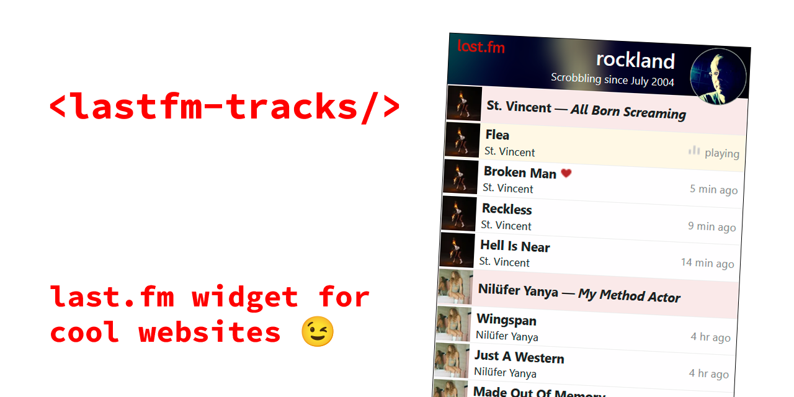

# 🔴 lastfm-widgets

_Tracks_ is a javascript web-widget to show "scrobbles" (play history) from a [Last-fm](https://www.last.fm/) account.
See _Tracks_ in action on https://www.rockland.dk/ and https://lastfm-widgets.stignygaard.deno.net/.
At the latter site, you can not only find some more information and instructions for use, you can
also play with some of the customization options, including setting the user to show scrobbles from.

[](https://www.last.fm/user/rockland)

Long time Last.fm users might get a déjà vu feeling by the red album header-lines. As primarily an album listener
myself, I have missed them. So I brought them (optionally) back in this widget.

As name of this repository hints, I might have more than one Last.fm widget planned for this space 🙂

## How to Use / Installation

Using the widget in any HTML file is straightforward because it's a standard web component. You only need to import the script and place the custom HTML tag where you want it to appear.

```html
<!DOCTYPE html>
<html lang="en">
<head>
    <meta charset="UTF-8">
    <title>My Last.fm Scrobbles</title>
    <!-- 1. Import the widget's js as a module -->
    <script type="module" src="./widgets/lastfm.js"></script>
</head>
<body>

    <!-- 2. Use the custom web component tag -->
    <lastfm-tracks 
        user="rockland" 
        tracks="50">
    </lastfm-tracks>

</body>
</html>
```
Notice, you should _not_ include the stylesheet (tracks.css) yourself. The script (lastfm.js) will automatically include it.
Just make sure to place it at the same location as the script file, as that is where it will look for the stylesheet.

### Customization Attributes

You can easily customize the widget by adding attributes to the `<lastfm-tracks>` tag:

- `user`: The Last.fm username to fetch scrobbles for.
- `tracks`: The number of tracks to display (default 50, max 200).
- `apikey`: Your Last.fm API key. (Only required if you are running in Basic mode directly from the browser without a proxy. If omitted, the widget runs in Demo mode, fetching once with a built-in demo key).
- `backend`: If you've set up a backend proxy (see the `/services/` folder), provide its URL here instead of using the `apikey` attribute. This is highly recommended for production!
- `interval`: Refresh interval in seconds (Basic mode min. 30, Backend mode min. 10).
- `updates`: Number of updates before stopping.

For a full list of attributes and an interactive customization playground, check out the [demo site](https://lastfm-widgets.stignygaard.deno.net/).

## The technical...

The _Tracks_ widget itself is made as a _webcomponent_ using pure standard web client-side technologies (no frameworks
or build tools needed). It can work "alone" communicating directly with Last.fm's Audioscrobbler v2 API, or it can be
supported by a custom backend "proxy-api". The latter is encouraged when possible, because it makes it possible to
implement throttling of requests to Last.fm's API.

This repository not only holds the widget itself, but also the demo-site (https://lastfm-widgets.stignygaard.deno.net/)
and two backend proxy-api implementations. The "primary" proxy-api is made in [Deno](https://deno.com/) using [Deno KV](https://docs.deno.com/deploy/kv/).
The "alternative" proxy-api is a Cloudflare Workers implementation made by [burnblazter](https://github.com/burnblazter). 
Also, this repository is set up as a [Deno Deploy](https://deno.com/deploy) project. Any updates to the main-branch
(widget, demo-page and the Deno proxy-api) are immediately deployed to the Deno Deploy demo-site.

The widget itself should be compatible back to at least Firefox 115 and Chromium 109 based web-browsers
(so it also works for Windows 7/8 users stuck on these versions). It also runs in Safari, but I'm unsure how old versions are
supported. The backend code (Deno proxy-api) is my first simple experiments/experience with Deno.

#### /widgets/ folder

The widget frontend code. _All_ that is needed for widget to work in _Demo_ or _Basic_ mode. See
[Releases](https://github.com/StigNygaard/lastfm-widgets/releases) to get the latest "release-version" of this folder's
content. And see https://lastfm-widgets.stignygaard.deno.net/ for more about widget _modes_
and how to use and customize the widget.

#### /demo/ folder

Frontend-code for the demo page seen on https://lastfm-widgets.stignygaard.deno.net/.

#### /services/ folder

- _proxy-api.ts_ - A backend proxy-api made with Deno. The proxy-api is used on the demo page when widget is in
  _Backend-supported_ mode, but also used by widget on [rockland.dk](https://www.rockland.dk/).
- _log.ts_ - A simple log endpoint used by the demo page.

For full documentation on setting up the backend proxies, see [services/README.md](services/README.md).

#### /cf-worker/ folder

An alternative Cloudflare Worker backend proxy-api. Kindly contributed to this project by [burnblazter](https://github.com/burnblazter).

For full documentation on setting up the backend proxies, see [services/README.md](services/README.md).

#### /main.ts file

Basically the "web-server" or "router" for https://lastfm-widgets.stignygaard.deno.net/, serving
the above-mentioned content (except /cf-worker/).

## Future updates?

What could future updates bring? _Maybe_:

- A layout that adapts nicer to wider display dimensions of widget
- Dark mode
- Another widget
