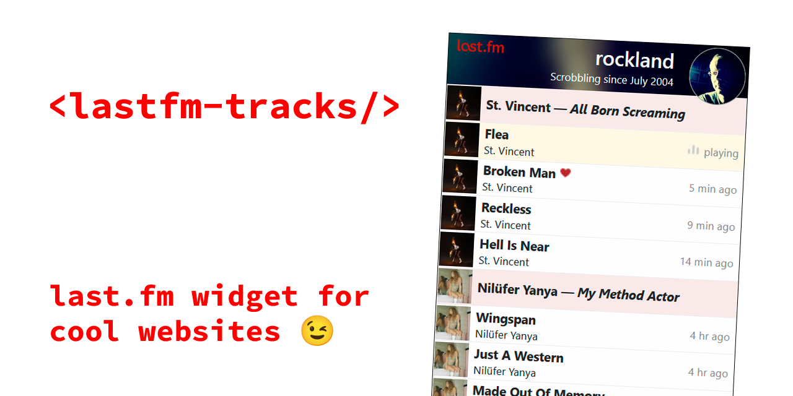

# 🔴 lastfm-widgets

_Tracks_ is a javascript web-widget to show "scrobbles" (play history) from a [Last-fm](https://www.last.fm/) account.
See _Tracks_ in action on https://www.rockland.dk/ and https://lastfm-widgets.stignygaard.deno.net/.
At the latter site, you can not only find some more information and instructions for use, you can
also play with some of the customization options, including setting the user to show scrobbles from.

Long time Last.fm users might get a déjà vu feeling by the red album header-lines. As primarily an album listener
myself, I have missed them. So I brought them (optionally) back in this widget.

As name of this repository hints, I might have more than one Last.fm widget planned for this space 🙂

## How to Use

Using the widget in any HTML file is straightforward because it's a standard web component. You only need to import the script and place the custom HTML tag where you want it to appear.
You can configure the widget by adding attributes to the custom HTML tag. Get the details and play with the customization options on the [interactive demo site](https://lastfm-widgets.stignygaard.deno.net/ "The demo-page is an interactive playground for widget customization").

Optionally, you can also [add a "proxy-API" to your setup](https://github.com/StigNygaard/lastfm-widgets/blob/main/services/README.md "How to set up a proxy-API for the Tracks widget").

## The technical...

The _Tracks_ widget itself is made as a _webcomponent_ using pure standard web client-side technologies (no frameworks
or build tools needed). It can work "alone" communicating directly with Last.fm's Audioscrobbler v2 API, or it can be
supported by a custom backend "proxy-api". The latter is encouraged when possible, because it makes it possible to
implement throttling of requests to Last.fm's API.

This repository not only holds the widget itself, but also the demo-site (https://lastfm-widgets.stignygaard.deno.net/)
and [_two_ different backend proxy-api implementations](services/README.md "How to set up a proxy-API for the Tracks widget").
The default/primary proxy-API is implemented in [Deno]([Deno](https://deno.com/)) and uses either Deno KV or just
memory for caching. But there's also an alternative Cloudflare Workers (Node.js) proxy-api implementation made
by [burnblazter](https://github.com/burnblazter). 
Also, this repository is set up as a [Deno Deploy](https://deno.com/deploy) project. Any updates to the main-branch
(widget, demo-page and the Deno proxy-api) are immediately deployed to the Deno Deploy demo-site.

The widget itself should be compatible back to at least Firefox 115 and Chromium 109 based web-browsers
(so it also works for Windows 7/8 users stuck on these versions). It should also run in Safari versions going pretty
far back, but I'm unsure exactly how old versions that are supported. The backend code (Deno proxy-api) is my
first simple experiments/experience with Deno (and server-side Javascript in general).

#### /widgets/ folder

The widget frontend code. _All_ that is needed for widget to work in _Demo_ or _Basic_ mode. See
[Releases](https://github.com/StigNygaard/lastfm-widgets/releases) to get the latest "release-version" of this folder's
content. And see the demo page at https://lastfm-widgets.stignygaard.deno.net/ for more about widget _modes_
and how to use and customize the widget.

#### /website/demo/ folder

Frontend-code for the demo page seen on https://lastfm-widgets.stignygaard.deno.net/.

#### /website/promo/ folder

Frontend-code for a simple promo page pointing to the demo page at https://lastfm-widgets.stignygaard.deno.net/.
This is the default webpage shown when this project is deployed. However, you can configure it to
show the demo page instead.  

#### /services/ folder

- `proxy-api.ts` - A Deno proxy-api using either in-memory or (by default) Deno KV cache.
- `log.ts` - A simple log endpoint used by the demo page.

On the demo-page, Deno KV is the normally used proxy-api when widget is in _Backend-supported_ mode – and it is also used by widget on [rockland.dk](https://www.rockland.dk/).

For full documentation on setting up the backend proxies, see [services/README.md](services/README.md "How to set up a proxy-API for the Tracks widget").

#### /cf-worker/ folder

An alternative Cloudflare Worker backend proxy-api. Kindly contributed to this project by [burnblazter](https://github.com/burnblazter).

For full documentation on setting up the backend proxies, see [services/README.md](services/README.md "How to set up a proxy-API for the Tracks widget").

#### /main.ts file

Application "entrypoint". Basically the "web-server" or "router" for https://lastfm-widgets.stignygaard.deno.net/,
serving the above-mentioned content (except `/cf-worker/`).

## Future updates?

What could future updates bring? _Maybe_:

- A layout that adapts nicer to wider display dimensions of widget
- Dark mode
- Another widget
